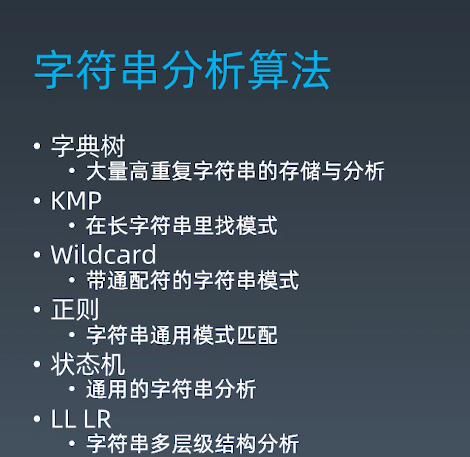

# week 3 编程与算法训练

### Date: Aug 30, 2020

### Topic:

字符串分析算法

proxy与双向绑定

使用Range实现DOM精确操作

### Motivation:

---

### Cues

[如何更好地理解和掌握 KMP 算法?](https://www.zhihu.com/question/21923021/answer/1032665486)

这篇知乎上面的回答 说的非常棒。

proxy : 其实类似于C++中的指针，但是不是完全一样的。

javascript中函数是一定公民这句话怎么理解:

[https://www.zhihu.com/question/67652709/answer/255460149](https://www.zhihu.com/question/67652709/answer/255460149)

函数是一等公民这句话对应的英文原文应该是first-class object(第一类对象)

函数也是一种对象。

简单说就是一等公民什么都能做，次等公民各种不能做。

让我们一起来看看js中的function能干什么：

- 可以有属性
- 可以赋值个一个变量
- 可以放在数组中作为元素
- 可以最为其他对象的属性
- 可以作为一个函数的参数
- 可以作为函数的返回值
- 可以赋值个变量

### Notes

lesson 1: 字符串分析算法



字典树是用来精确匹配字符串和模式的：

KMP:是找部分匹配的

Wildcard: 使用的是贪心算法，通配符就是问号星号等

正则：使用回溯，字符串匹配的终极版本

状态机：比正则更强大。可以嵌入代码

LL: LR比LL更强大，LL理论性比较强

Lesson 2: 字典树


将字符串编程树形结构

字典树是哈希树的特例

Lesson 3. 字符串分析算法 | KMP 字符串模式匹配算法

KMP是为了解决什么问题的：简单说就是查看一个字符串里面有没有另一外一个字符串。 使用Brute froce需要 O(m + n) 复杂度。

传统的brute force 算法展示:


在 Brute-Force 中，如果从 S[i] 开始的那一趟比较失败了，算法会直接开始尝试从 S[i+1] 开始比较。这种行为，属于典型的“没有从之前的错误中学到东西”

### KMP:

尽可能利用残余的信息，是KMP算法的思想所在。

上完这节课可以看看leetcode 28 这道题是标准的kmp

[Implement strStr() - LeetCode](https://leetcode.com/problems/implement-strstr/)

### Wildcard:

课后问题：正则是否可以用一个带问号的算法去替代。

wildcard 有两种通配符。不但有星号*还有问号？

for example:

ab*cd*abc*a?d

最后一个*号尽可能多的匹配字符 也就是上面橙色的星号

前面两个白色的*号 好尽量少的进行匹配

这里面用到了kmp算法。

如果不考虑? 那么一个wildcard就是若干个kmp来组成的。

wildcard = 带问号的 kmp

但是这里老师偷懒了 使用正则来找pattern

但是性能会是一个问题，这里我们逐段的转换成exec那么就不会有太大的问题

### Proxy:

老师不是很建议在生产代码中使用太多proxy 

但是不可否认他还是很强大的

```jsx
let object = {
	a: 1,
	b: 2
}

let po = new Proxy(object, {
	set(obj, prop) {
		console.log(obj, prop);	
	}
})

po.a = 3;
```

Reactive的实现原理：

Reactive也会通过proxy作为基础实现的

```jsx
let object = {
  a: 1,
  b: 2
}

let po = reactive(object);

function reactive(object) {
  return new Proxy(object, {
    set(obj, prop, val) {
      obj[prop] = val;
      console.log(obj, prop, val);
      return obj[prop];
    },
    get(obj, prop) {
      console.log(obj, prop);
      return obj[prop];
    }
  })
}

po.x = 99
```

课堂上的这个不是完整版本的想要看工程级别的reactivity可以去看看 vue的源代码

Reactivity有什么用

是一个半成品的双向绑定

我们通过一个调色盘的小页面来展示了一下mvvm编程

```jsx
<!DOCTYPE html>
<html lang="en">
  <head>
    <meta charset="UTF-8" />
    <meta name="viewport" content="width=device-width, initial-scale=1.0" />
  </head>
  <body>
    <input id="r" type="range" min=0 max=255 />
    <input id="g" type="range" min=0 max=255 />
    <input id="b" type="range" min=0 max=255 />
    <div id="color" style="width:100px;height:100px"></div>
  </body>
  <script src="reactive.js"></script>
</html>
```

page: preview:


### 实现拖拽

不是通常意义上的拖拽

而是要通过拖拽参与到html本身的排版当中


我们打算用mousedown mouseup 和 mousemove这样的一组时间来实现.

我们一般要实现一些视觉效果都离不开 CSSOM (CSS object model)

---

**SUMMARY:**   

- 这周主要是学习了一些词法分析相关的知识。
- 另外还写了一个不完全版本的reactive。reactivity 响应式对象其实底层还是proxy(也就是类似C++指针的东西)
- 另外还有一个调色板应用。
- 我们通常想要实现一下页面效果都需要操作 CSS object model