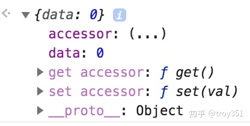

# week 4 重学JavaScript

### Date: Aug 30, 2020

### Topic:

1. JS语言通识
2. JS类型
3. JS对象

### Motivation:

为了建立一个大的关于javaScript的框架 ，更加深入的还得看书

---

### Cues

编程语言编译器的实现与形式语言理论有关

形式语言的用处：

只说我接触过的：编程语言编译器的实现与形式语言理论有关。目前的编程语言大多都依赖于上下文无关文法。譬如词法分析和正则表达式对应于正则文法。语法分析有很大的一部分是关于上下文无关文法的。

正则表达式有多有用就不赘述了。单说编译原理的部分，不要觉得学会编译原理就只能写编译器了，然后自己不写编译器也用不到。NAIVE！处理 XML 和 json 字符串啦，查找蛋白质模式啦，Web 的模板引擎啦，代码的语法高亮，自动生成代码，转化代码到 UML 图，OpengGL 里的 shader 啦等等有各种各样好玩的应用。这些都是和形式语言相关的。

差不多就这样，想到新的了再补充。

关于IEEE-754 我们有下面的wiki page  可以延伸阅读

[跳转中...](https://link.zhihu.com/?target=https%3A//zh.wikipedia.org/wiki/IEEE_754)

float浮点数的 真正意思是。小数点可以来回浮动的意思

JavaScript有7种基本类型

但是还有一个bigInt是在制定当中的。算上就是8种

[为什么JavaScript要分数据属性和访问器属性？](https://www.zhihu.com/question/295168343/answer/494799739)

```jsx
const obj = {};

obj.defineProperty(obj, 'data', {
	value: 0,
	writable: true,
	configurable: true,
	enumerable: true
});
//等价于
obj.data = 0;

obj.defineProperty(obj, 'accessor', {
	set(val) { this.data = val; },
	get() { return this.data; },
	configurable: true,
	enumerable: true
});

```

结果就是一个obj 上面可以既有数据属性也有访问器属性。



### Notes

lesson 1:

语言按语法分类：

1. 非形式语言：中文，英文
2. 形式语言：有形式化定义
    1. 乔姆斯基谱系(上下包含关系)
        1. 0型无线制文法
        2. 1型 上下文先关文法
        3. 2型 上下文无关文法
        4. 3型 正则文法

lesson 2:什么是产生式

产生式 BNF


BNF

1. BNF范式是一种用递归的思想来表述计算机语言符号集的定义规范
2. 法则：
    1. ::=表示定义；
    2. “ ”双引号里的内容表示字符；
    3. <>尖括号里的内容表示必选内容；
    4. | 竖线两边的是可选内容，相当于or；


javaScript 大多数是后是上下文无关文法，但是严格的来讲是上下文相关文法 比如get 这样的 关键字之类的

- [乔姆斯基谱系](https://zh.wikipedia.org/wiki/%E4%B9%94%E5%A7%86%E6%96%AF%E5%9F%BA%E8%B0%B1%E7%B3%BB)：是计算机科学中刻画形式文法表达能力的一个分类谱系，是由诺姆·乔姆斯基于 1956 年提出的。它包括四个层次：
    - 0- 型文法（无限制文法或短语结构文法）包括所有的文法。
    - 1- 型文法（上下文相关文法）生成上下文相关语言。
    - 2- 型文法（上下文无关文法）生成上下文无关语言。
    - 3- 型文法（正规文法）生成正则语言。
- 终结符： 最终在代码中出现的字符（ [https://zh.wikipedia.org/wiki/ 終結符與非終結符](https://zh.wikipedia.org/wiki/%E7%B5%82%E7%B5%90%E7%AC%A6%E8%88%87%E9%9D%9E%E7%B5%82%E7%B5%90%E7%AC%A6))


[https://medium.com/@zach.gollwitzer/imperative-vs-declarative-programming-procedural-functional-and-oop-b03a53ba745c](https://medium.com/@zach.gollwitzer/imperative-vs-declarative-programming-procedural-functional-and-oop-b03a53ba745c)

- **Imperative programming** is about how a program works while*
- **Declarative programming** is about what a program does. Let’s look at an example.

[https://en.wikipedia.org/wiki/List_of_programming_languages_by_type#Imperative_languages](https://en.wikipedia.org/wiki/List_of_programming_languages_by_type#Imperative_languages)

[https://en.wikipedia.org/wiki/Category:Declarative_programming_languages](https://en.wikipedia.org/wiki/Category:Declarative_programming_languages)

编程语言性质：


所有可计算的问题都可以用来描述的 就是具备图灵完备性的

图中的三种方式都能实现图灵完备性

lambda 演算可以通过递归实现图灵完备

动态语言静态语言：

动态：

- 在用户设备/在服务器上
- 产品实际运行时
- runtime

静态：

- 在程序员的设备上
- 产品开发时
- compiletime

但是现在如果这么按照compile time和 runtime稍微有点不准确了

类型系统：


javaScript 就是一个典型的弱类型语言

- [图灵完备性](https://zh.wikipedia.org/wiki/%E5%9C%96%E9%9D%88%E5%AE%8C%E5%82%99%E6%80%A7)：在可计算性理论里，如果一系列操作数据的规则（如指令集、编程语言、细胞自动机）可以用来模拟单带图灵机，那么它是图灵完全的。这个词源于引入图灵机概念的数学家艾伦·图灵。虽然图灵机会受到储存能力的物理限制，图灵完全性通常指“具有无限存储能力的通用物理机器或编程语言”。
- [图灵机（Turing machine）](https://zh.wikipedia.org/wiki/%E5%9B%BE%E7%81%B5%E6%9C%BA)：又称确定型图灵机，是英国数学家艾伦·图灵于 1936 年提出的一种将人的计算行为抽象掉的数学逻辑机，其更抽象的意义为一种计算模型，可以看作等价于任何有限逻辑数学过程的终极强大逻辑机器。
- 静态和动态语言： [https://www.cnblogs.com/raind/p/8551791.html](https://www.cnblogs.com/raind/p/8551791.html)
- 强类型： 无隐式转换
- 弱类型： 有隐式转换
- 协变与逆变： [https://jkchao.github.io/typescript-book-chinese/tips/covarianceAndContravariance.html](https://jkchao.github.io/typescript-book-chinese/tips/covarianceAndContravariance.html)

Lesson 6: JS语言通识 | 一般命令式编程语言的设计方式


接下来我们的课程就会按照上面的这个顺序来进行javaScript语言的学习

### LESSON 7: JS类型 number


首先介绍JAVASCRIPT 的7种类型

- Number
- String
- Boolean
- Object
- Null
- Undefined
- Symbol

上面的前五种算是我们最常用的

null和 undefined比较容易混淆

null 有值但是是空的

undefined 代表从来就没有人定义过值

null在早起设计的时候出现了一些偏差 所以他的typeof 的值

最后会出来一个object. 这个是我们经常喷javaScript的一点

**重要的是这个东西是JavaScript确认不会去修复的一个东西**

number 按照定义应该叫做double float


上面这个的意思就是将number拆成 指数和有效位数

有效位数决定float的精度

指数决定了 浮点数的范围

sign符号是表示正负的意思

上面每一位就是一个bit 可以是0或者1

能表示最小的是2的负十次放 最大的是2的正十次方


我们下面看来深入的理解一下JavaScript中的number

我们将这个number拆分上面的几个组成部分。

exponent是

Number 的语法


当我们写0.toString()会出问题

所以正确的写法是0 .toString()

因为0. 被当成0了 这个点被忽略了 不是我们想要的意思

另外0..toString()也是可以的 因为第一个.被忽略掉了 但是第二个还是生效的

LESSON 8: String 类型


code point 就是数字

我们要真正的理解String 需要理解字符 码点 和编码方式


早年因为字符比较少 所以我们管字符的编码 都叫ASCII码 

**ASCII**知识计算机中最常用的一些字符 包括大小写特殊字符数字等

但是这个肯定就没法表示中文了

后来我们就发明了 **Unicode**将全世界所有的字符都囊括进去形成了 一个大的合集，按照一个一个片区分给不懂的语言文字

GB是国标

台湾一直用BIG5 导致我们用unicode时候看见都是乱码。

编码：


下面是我们汉字 一的 表示


Homeworking- JS represents UTF-8 转换

```jsx

```

String Grammer:

”abc“

‘abc’

`abc`


String-Grammer-template

`ab${x}abc${y}abc`

### JS其他类型

Boolean: true  false

NULL & Undefined:

null 代表空值

undefined 代表根本就没有人 设过值

如果我们就是想得到undefined的值

可以使用Void

### JavaScript Object

example:


Object-class:


Object-Prototype:


class是分类 prototype是相似 更贴近人的直觉

原型(prototype)适合不那么清晰描述比较自由的一些场景

分类(class)适合 严谨的场景

```jsx
class Dog {
    constructor(name) {
        this.name = name;
    }
    bite(name) {
      console.log(`I bite ${name}`);
    }
}

class Human {
    constructor(name) {
        this.name = name;
    }
    hurt(name) {
      console.log(`I hurt by ${name}`);
    }
}
```

对象的行为必须是改变对象状态的

### 11. JS对象 | JS中的对象


属性一般是用来描述状态的，但是javascript属性既可以用来描述状态也可以用来描述行为

**唯一标识性：**

绝大多数编程语言都是用内存地址的唯一性来表示对象的唯一性

**JavaScript 获取属性：**

但我们去寻找一个属性如果在自身找不到就会去原型链上去找

当我们寻找原型会一路一直找上去 直到找到nihilo 也就是null

### **属性**

javaScript属性是key value键值对

symbol即使名字一样他们也不是相等的　有点类似对象都是具有唯一性。

这样我就可以达到属性权限控制，如果你不把这个symbol的名字传递给下一家，使用者是没有办法访问你用symbol 名字作为k的属性值的


JavaScript数据的两种属性

数据属性和访问器属性

数据属性存值，访问器属性不存值。详情请参考左面提供的链接

JavaScript原型机制：

javascript的原型链机制保证了 每个对象只需要描述自己和原型的区别即可


Object 相关语法和API  我们可以将他们分成下面四个部分：

- {} . [] Object.defineProperty

 (提供了基本的对象机制，让我们可以通过这些语法去创建对象，定义新的属性，以及去改变属性的特征值)

- Object.create / Object.setPrototypeOf / Object.getPrototypeOf  (基于原型的描述对象的方法)
- new / class / extends (基于class的方式去描述对象，在运行时会被转化成javaScript原型相关的访问，但是语法结构上其实是基于类的)
- new / function / prototype (历史包袱，有点不伦不类, 建议不要用)

### Function Object


除此之外还有数组对象等


作业：找出所有JavaScript标准里面所有具有特殊行为的对象

就是那些我们没法通过属性加原型来描述的这样的对象的行为

[https://zhuanlan.zhihu.com/p/136634753](https://zhuanlan.zhihu.com/p/136634753)

---

**SUMMARY:**