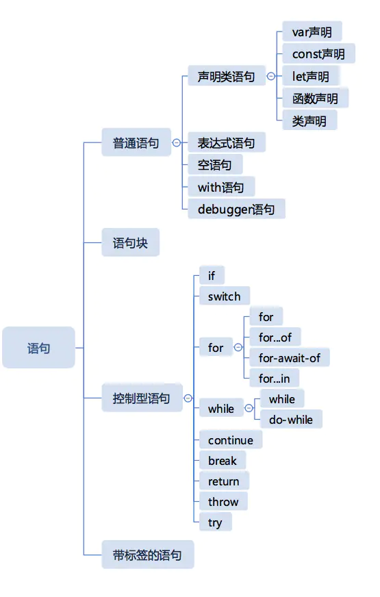

# 前端训练营 Week 5 重学JavaScript

### Date: Sep 28, 2020

### Topic:

- 运算符和表达式
- 类型转换
- 运行时相关概念
- 简单语句和复合语句
- 声明
- 宏任务和微任务
- JS函数调用

### Motivation:

重新认识一下JavaScript夯实基础

### Cues

这个unboxing实际工程中有什么用处呢？

语句脑图



### Notes

Expression:


a.b 和 a[b] 都是成员访问

member运算优先级都是一致的

JavaScript 就是用引用类型在运行时来处理 delete 或者assign相关操作的

Reference:

- Object
- Key

Call 比之前的member 和 new 优先级要低


new a()['b'] 所以这个正确的理解是 new 出来一个a对象然后访问它的b属性

Expression 分成 left hand-side expression 和 right hand-side expression

```jsx
//example
a.b = c;     //legal
a + b = c;   //illegal
```

update 就是一个right hand-side expression


unary 单目运算符


void 把后面不管啥 都变成undefined

次方


下面是一些更低优先级的运算


下面是优先级更低的


==是臭名昭著的 运算符号 问题很多

如果我们可以确定两边类型是相等的类型可以用==

逻辑运算基本上市优先级最低的


logical 和 conditional都是有短路逻辑的

### Lesson 2:


上面这个就是javascript中的类型转换，记这个有啥用？

unboxing 拆箱转换：

拆箱转换就是我们将一个普通object 转换成一个普通的类型

- ToPremitive
- toString vs valueOf
- Symbol.toPrimitive

```jsx
var o = {
	toString() { return "2" },
	valueOf() { return 1 },
	[Symbol.toPrimitive() { return 3 }]
}
```

Boxing 装箱转换：


对于基本类型我们javascript都提供了一个包装的类，

严格的说也不是每一个基本类型都有 别入null和 undefined

Lesson 3: 语句

- 简单语句
- 组合语句
- 声明（js标准中声明和语句是分开的，但是课程里我们给放到一起了）

Runtime:

- completion record
- lexical Environment(作用域)

Completeion Record 组成:

- [[type]]: normal, break, continue, return, or throw
- [[value]]: 基本类型
- [[target]]: label

Completion Record 表示一个语句执行完之后的结果，它有三个字段：

1. [[type]] 表示完成的类型，有break continue return throw和normal几种类型；
2. [[value]] 表示语句的返回值，如果语句没有，则是empty；
3. [[target]] 表示语句的目标，通常是一个 JS 标签（标签在后文会有介绍）。

Lesson 4:简单语句 复合语句

简单语句：

- ExpressionStatement !!!核心
- EmptyStatement
- DebuggerStatement
- ThrowStatement
- BreakStatement
- ReturnStatement (yield...)

复合语句：

- BlockStatement  !!!重要的
- IfStatement
- SwitchStatement   不是很建议使用
- IterationStatement
- WithStatement  现代很多编程规范都拒绝使用with
- LabelledStatement
- TryStatement   try catch finally


白色的地方就是可以加变量声明的


声明：


目前鼓励右侧的写法


 

Pre-process:


在更早的ECMA Script 3.0 还有作用域链 但是现在不用考虑了

### Lesson 6: 宏任务和微任务


事件循环：


函数调用本身就是一个stack


执行上下文


javaScript每一个函数都会生成一个闭包：

每个函数都有:

environment record和 code

---

**SUMMARY:**   

- 介绍了多种expression以及他们的优先级
- 重新学习javasccript语法