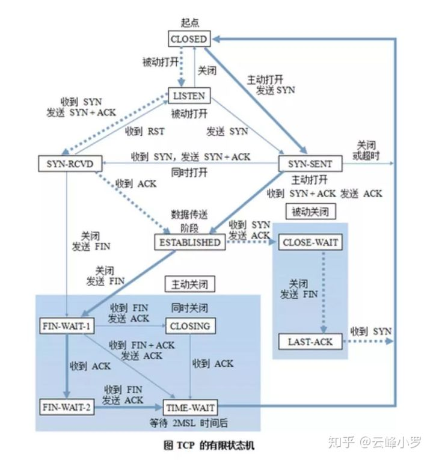

# Week 6 前端训练营 浏览器工作原理

### Date: Oct 5, 2020

### Topic:

学习浏览器原理

手写一个mini 浏览器

### Motivation:

基于node.js 环境去实现一个浏览器

### Cues

图解浏览器的基本工作原理

[图解浏览器的基本工作原理](https://zhuanlan.zhihu.com/p/47407398)

这里面我们先不管一些附加功能 比如收藏等

下面就是一个TCP协议状态机



有限状态机是表示有限个状态以及在这些状态之间的过渡和动作等行为的数学计算模型[^1]。(数学计算模型这个词要是觉得难理解，在脑海中换成结构即可。)

延伸阅读：

这篇文章介绍 状态机在前端开发中的应用

[web 开发中无处不在的状态机](https://zhuanlan.zhihu.com/p/26524390)

另外阮一峰这篇介绍状态机的也不错

[JavaScript与有限状态机](http://www.ruanyifeng.com/blog/2013/09/finite-state_machine_for_javascript.html)

### Notes

浏览器的渲染流程  url → bitmap


最后从bitmap传到显卡浏览器 就是我们看见的网站了

bitmap最后传给我们的显卡驱动设备 我们才能网页

有限状态机处理字符串：


有限状态机: 其实一种编程思想。过去挺流行的后来用的少了。

- Moore 状态机
- Mealy 状态机

状态机在游戏AI中经常使用

[https://zhuanlan.zhihu.com/p/260300717](https://zhuanlan.zhihu.com/p/260300717)


首先我们来用

- 在一个字符串中，找到字符"a" 来当做例子

```jsx
//my code
function findAFromSting(str) {
  if (!arrayName && arrayName.length == 0) {
    return false;
  }
  let strArray = str.split('');
  for (i in strArray) {
    if (i.toLowerCase == 'a') {
      return true;
    }
  }
  return true;
}
```

```jsx
//teacher's code
function match(string) {
	for (let c of string) {
		if (c == "a") {
			return true;
		}
	}
	return false;
}
match("I am groot");
```

- 在一个字符串中，找到字符"ab" 来当做例子 要求不使用正则表达式

```jsx
//my code
function match(str) {
	for (let i = 0; i < str.length; i++) {
		if (str[i] == 'a') {
			if (str[i + 1] == 'b') {
				return true;
			}
		}
	}
	return false;
}
console.log(match("abc"));
```

```jsx
//teacher code
function match() {
	
}
console.log(match());
```

使用状态机处理字符串 匹配abc：

```jsx
//find abc from string
function match(string) {
	let state = start;
	for (let c of string) {
		state = state(c);
	}
	return state === end;
}

function start(c) {
	if (c === "a") {
		return foundA;
	}
	else {
		return start(c);
	}
}

//trap
function end(c) {
	return end;
}

function foundA(c) {
	if (c === "b") {
		return foundB;
	}
	else {
		return start(c);
	}
}

function foundB(c) {
	if (c === "c") {
		return end;
	}
	else {
		return start(c)
	}
}
console.log(match("abcsd"))
```

HTTP请求 | HTTP 协议解析


TCP 与 IP 的基础知识

- 流 (TCP 层传输数据的概念)
- 端口（重要的TCP协议概念） - 软件都会去网卡拿数据，具体哪个数据给哪个软件就是端口决定的
- 包
- IP地址
- require('net') 对应的node中的包

HTTP:

- request
- response

每一个request 对应一个respose

接下来我们就需要手动实现 request 和 response

- [x]  首先我们需要用node去实现服务端
- [ ]  然后我们的小浏览器去获取这个网页

```jsx
const http = require('http');

http.createServer((request, response) => {
  let body = [];
  request.on('error', (err) => {
    console.error(err);
  }).on('data', (chunk) => {
    body.push(chunk.toString());
  }).on('end', () => {
    body = Buffer.concat(body).toString();
    console.log("body:", body);
    response.writeHead(200, {'Content-Type': 'text/html'});
    response.end('Hello World\n');
  });
}).listen(8088);

console.log("server started");
```

```
TODO: implement client.js
```


HTTP协议是一个文本型协议。

下面是http request:


然后我们需要实现一个http请求：

- [ ]  node写服务端


**SUMMARY:**   

理论：

* 学习了有限状态机

* 理解浏览器的工作原理

实践：

* 然后实现一个tiny browser

